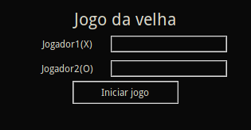

> ## Jogo da velha - Python/Tkinter

*Jogo da velha feito em python para testar conhecimentos após a conclusão dos cursos da Coursera:*

- [Coursera part. 01](https://github.com/Weslley41/coursera_python_parte01)

- [Coursera part. 02](https://github.com/Weslley41/coursera_python_parte02)

> ## Exemplos de execução

- Tela inicial

*Entrada de nomes com até 16 caracteres*

- Execução do jogo

*Exemplos de mudança do título/Fim da partida*

